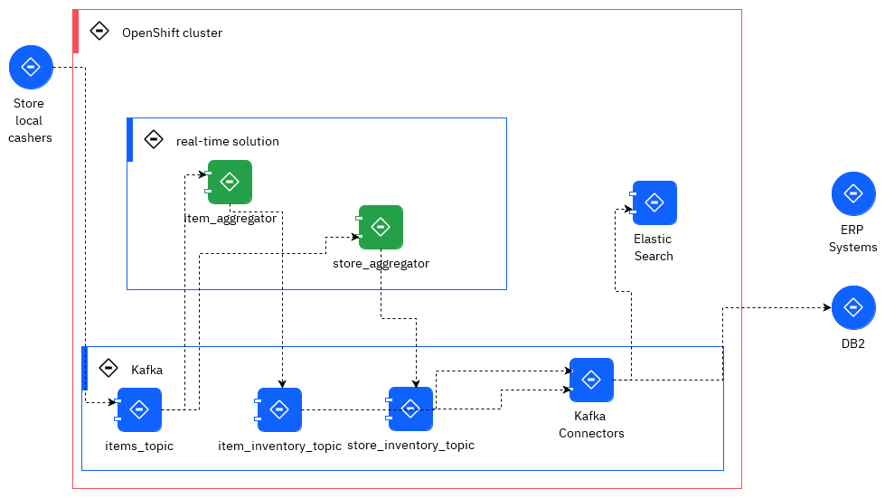

# Real time inventory demo GitOps

This gitops uses OpenShift GitOps and OpenShift Pipelines to manage the deployment and build
of the solution.

## Scenario presentation

This scenario implements a simple real time inventory management solution based on some real life MVPs we developed in 2020. 

Stores are sending their sale transactions to a central messaging platform, based on queues or topics.

As illustrated by the following figure, we are using Kafka / Event Streams to support
the events pub/sub and then need to have aggregators to compute store inventory and 
item inventory cross stores. 




* The store simulator injects directly sell events to Kafka to the `items` topic
* The store simulator can also generate messages to IBM MQ using JMS API or to RabbitMQ using AMQP protocol
* When messages are sourced to Queues, then a Kafka Source Connector is used to propagate message to `items` topics.
* The Item-aggregator component computes items inventory cross stores, so aggregate at the item_ID level. 
* The Store-aggregator computes aggregate at the store level for each items.

### Two alternates for the data stream processing.

We propose two approaches to develop the streaming processing. 

* One using Kafka Streams 
* One using Apache Flink

#### Kafka Streams implementation

We have transformed this implementation into a lab that can be read [here](https://ibm-cloud-architecture.github.io/refarch-eda/scenarios/realtime-inventory/)

* The Item-aggregator is in this project: [refarch-eda-store-inventory](https://github.com/ibm-cloud-architecture/refarch-eda-store-inventory)
* The Store-aggregator is in this project: [refarch-eda-store-inventory](https://github.com/ibm-cloud-architecture/refarch-eda-store-inventory)

## Run the solution locally

### Run the Kafka Stream implementation

Each service docker images are in the `quay.io/ibmcase` image registry.

* Start local kafka and service

```sh
cd demo/kstreams
docker compose up
```

* Create topics

```sh
# under demo/kstreams
./createTopics.sh
```

* Execute the demo: see script here :[refarch-eda/scenarios/realtime-inventory](https://ibm-cloud-architecture.github.io/refarch-eda/scenarios/realtime-inventory/#demonstration-script-for-the-solution)

Then for the simulator the console is: [http://localhost:8080/#/](http://localhost:8080/), and
follow the demo script defined in [this article](https://ibm-cloud-architecture.github.io/refarch-eda/scenarios/realtime-inventory/#demonstration-script-for-the-solution).

The store inventory API is at [http://localhost:8082](http://localhost:8082/q/swagger-ui)

The item inventory API is at [http://localhost:8081](http://localhost:8081/q/swagger-ui)

Kafdrop UI to see messages in topics is at [http://localhost:9000](http://localhost:9000)

* Stop the demo

```sh
docker compose down
```

### Run the Flink implementation


## GitOps Bootstrap

To start the CI/CD management with ArgoCD, just executing the following should work.

```sh
oc apply -k config/argocd
```

## CI part

The bootstrap should have created a rt-inventory-cicd project, with the upload
of pipelines, tasks, triggers, event listeners... All those are defined
in `config/rt-inventory-cicd` which could be tested directly with

```sh
oc apply -k config/rt-inventory-cicd
```

