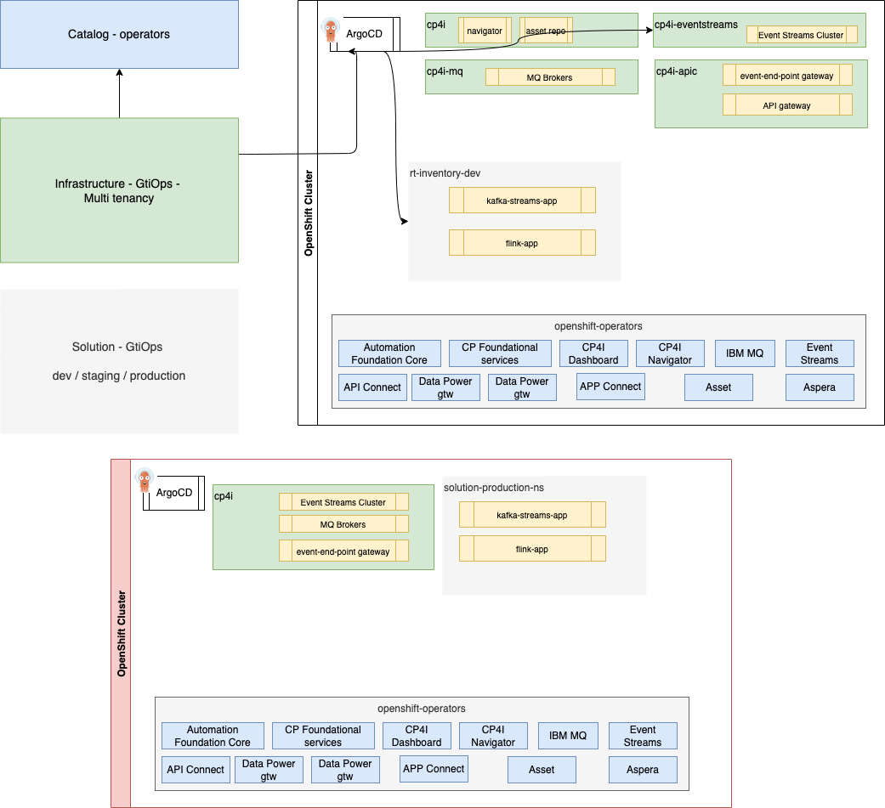

# Deploy on Existing CP4I cluster

This environment is when you want to deploy this solution on an existing IBM Cloud Pak for Integration demo environment, where Operators and Operandes are in the same namespace, which should be `cp4i`.

The digram below illustrates the GitOps approach. The Green rectangle defines how to deploy the Cloud Pak for Integration in a unique namespace and then share the cluster like event streams or MQ brokers 
between multiple solutions.



The Grey represents the dedicated solution microservices or stateful agents deployments.

So we assume the Green deployments are done for the white openshift cluster, which represents a development and quality assurance cluster.

Operators are deployed in openshift-operators namespace and monitor All namespaces.

## Verify pre-requisites

In this case we assume the following commands will show the prerequisites are ready:

```sh
oc project cp4i
oc get operators 
# Reulsts
aspera-hsts-operator.cp4i
couchdb-operator.cp4i
datapower-operator.cp4i
ibm-ai-wmltraining.cp4i
ibm-apiconnect.cp4i
ibm-appconnect.cp4i
ibm-automation-core.cp4i
ibm-cert-manager-operator.ibm-common-services
ibm-cloud-databases-redis-operator.cp4i
ibm-common-service-operator.cp4i
ibm-common-service-operator.ibm-common-services
ibm-commonui-operator-app.ibm-common-services
ibm-eventstreams.cp4i
ibm-iam-operator.ibm-common-services
ibm-ingress-nginx-operator-app.ibm-common-services
ibm-integration-asset-repository.cp4i
ibm-integration-operations-dashboard.cp4i
ibm-integration-platform-navigator.cp4i
ibm-management-ingress-operator-app.ibm-common-services
ibm-mongodb-operator-app.ibm-common-services
ibm-monitoring-grafana-operator-app.ibm-common-services
ibm-mq.cp4i
ibm-namespace-scope-operator.ibm-common-services
ibm-odlm.ibm-common-services
ibm-platform-api-operator-app.ibm-common-services
ibm-zen-operator.ibm-common-services
openshift-gitops-operator.openshift-operators
openshift-pipelines-operator-rh.openshift-operators
```

## Verify Event Streams bootstrap

* Get bootstrap URL

```sh
oc get svc | grep bootstrap
```

* Verify existing kafka users

```sh
oc get kafkausers
```

* Verify schema registry URL

```sh

```

## Prepare demo event streams elements

### Create topics

```sh
# go to the project where event streams cluster runs. The expected name of the cluster is `es-demo` if no change the topic declaration and then do:
oc apply -f environments/cp4i/services/ibm-eventstreams/base/topics.yaml
# verify topic ae ready
oc get kafkatopics 
# Results
NAME                                                           CLUSTER   PARTITIONS   REPLICATION FACTOR   READY
consumer-offsets---84e7a678d08f4bd226872e5cdd4eb527fadc1c6a    es-demo   50           1                    True
rt-demo.item.inventory                                         es-demo   1            3                    True
rt-demo.items                                                  es-demo   3            3                    True
rt-demo.store.inventory                                        es-demo   1            3                    True
strimzi-store-topic---effb8e3e057afce1ecf67c3f5d8e4e3ff15      es-demo   1            3                    True
strimzi-topic-operator-kstreams-topic-store-changelog---b75e70 es-demo   1            1                    True
```

If you do not see the topic ready and created in the UI, this is because the topicOperator is not defined in the event stream cluster. Add the following under `strimziOverrides`

```yaml
  strimziOverrides:
    entityOperator:
      topicOperator: {}
      userOperator: {}
```

## Deploy without GitOps

This section is defining how to deploy the solution step by step.

* Create namespace

  ```sh
  oc apply -k environments/cp4i/env/
  ```

* Define topics, users, and copy secrets

  ```sh
  oc apply -k environments/cp4i/services/ibm-eventstreams/overlays
  ```

* Deploy MQ services

  ```sh
  oc apply -k environments/rt-inventory-dev/services/ibm-mq/overlays
  # Get the Admin URL
  chrome $(oc get route store-mq-ibm-mq-qm  -o jsonpath='{.status.ingress[].host}')
  ```

* Deploy Store Simulator

  ```sh
  oc apply -k environments/cp4i/apps/store-simulator/overlays/cp4i
  # Get its user interface
  chrome http://$(oc get routes store-simulator -o jsonpath='{.status.ingress[].host}')
 
  ```
* Run the simulator to MQ backend; then verify messages are in the QM1 / ITEMS queue.

* Deploy Kafka Connect Cluster 

  ```sh
  oc apply -n cp4i-eventstreams -k environments/cp4i/services/kconnect/overlays
  ```

* Access to the Event Streams User Interface

  ```sh
  # go to the project where event streams run
  chrome https://$(oc get route es-demo-ibm-es-ui  -o jsonpath='{.status.ingress[].host}')
  ```


