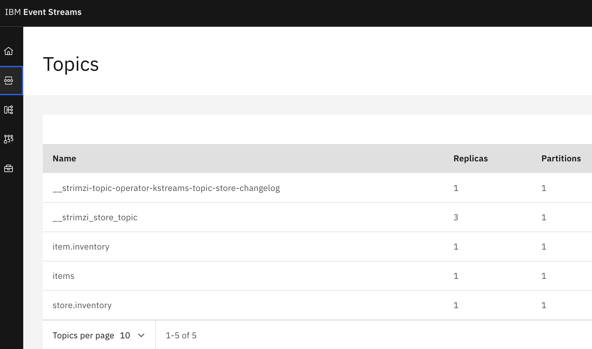
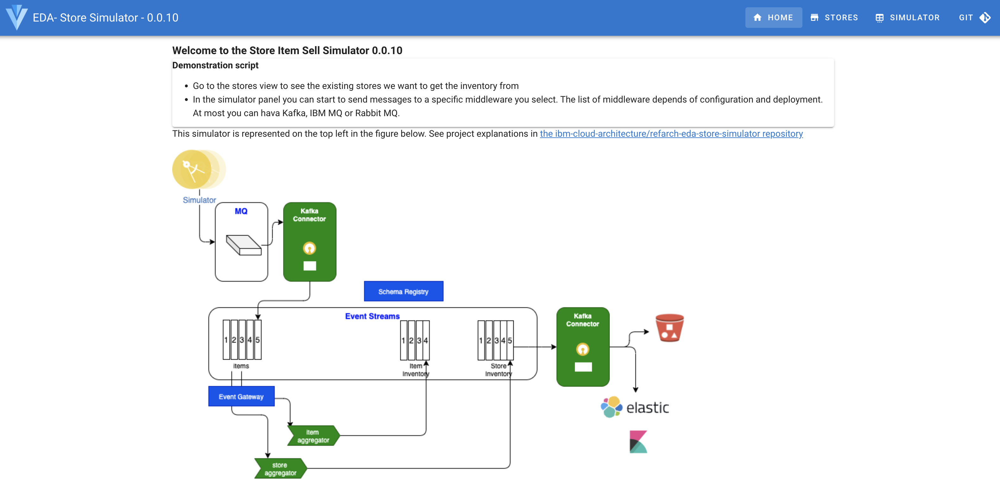
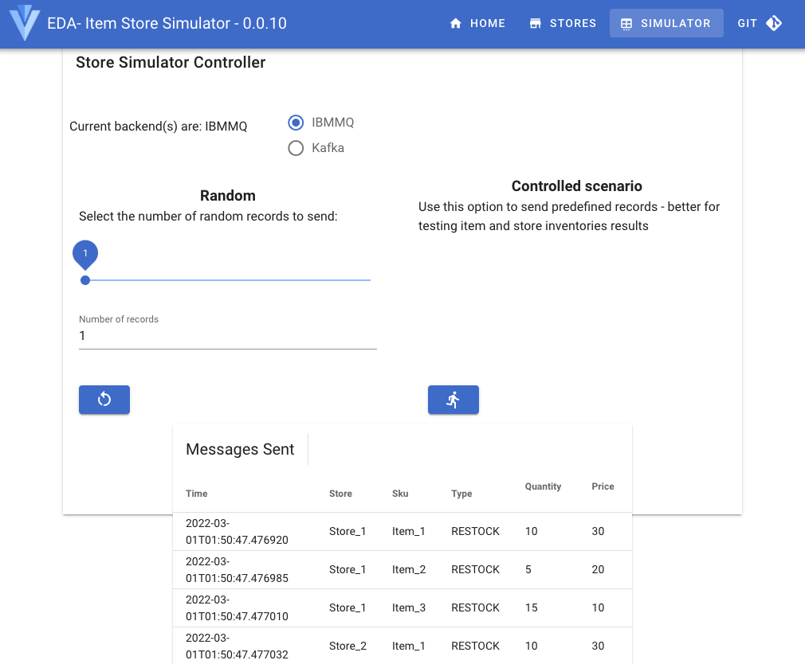

# A manual deployment of the operators, components and services

This is the manual deployment of the real-time inventory solution. 

## Pre-requisites

Be sure to have:

* oc cli
* IBM Entitlement key
* OpenShift clsuter 4.7+

## Steps to deploy the infrastucture and needed CP4I components

> If you are using an environment where Event Streams, MQ, API Connect operators are deployed in a namespace and not in `openshift-operators` level to monitor `All namespace`, then it is recommended to install this solution where the cloud Pak for integration runs. The happy path of this deployment is to have operators in `openshift-operators` and being able to install clusters, brokers and microservice in a dedicate project: `rt-inventory-lab`. To try to be exhaustive, we will use some side notes to present what to tune in case you are reusing an existing deployment, by taking the example that operators and operands are in `cp4i` project.

1. Login to the Openshift Console
1. Create a project for the solution name it `rt-inventory-lab`, or go to existing project: `oc project cp4i`

    ```sh
    oc new-project rt-inventory-lab
    ```

   
1. Deploy the IBM product catalog - (Not needed if `cp4i` already deployed)

    ```sh
    make  prepare_ibm_catalog
    ```


1. Obtain your [IBM license entitlement key](https://github.com/IBM/cloudpak-gitops/blob/main/docs/install.md#obtain-an-entitlement-key) - (Not needed  if `cp4i` already deployed)
1. Update the [OCP global pull secret of the `openshift-operators` project](https://github.com/IBM/cloudpak-gitops/blob/main/docs/install.md#update-the-ocp-global-pull-secret)
with the entitlement key. - (Not needed if `cp4i` already deployed)

    ```sh
    export KEY=<yourentitlementkey>
    oc create secret docker-registry ibm-entitlement-key \
    --docker-username=cp \
    --docker-server=cp.icr.io \
    --namespace=openshift-operators \
    --docker-password=$KEY 
    ```

1. If not done before, deploy Event Streams, IBM MQ and API Connect Operators- (Not needed if `cp4i` already deployed)

    ```sh
    # Verify if some operator are present
    oc get -n openshift-operators subscription ibm-eventstreams 
    # install them if not
    make install_es_operator install_mq_operator
    ```

1. Copy IBM Entitlement secrets to the `rt-inventory-lab` project - (Not needed if `cp4i` already deployed)

    ```sh
    ./bootstrap/scripts/copySecrets.sh ibm-entitlement-key  openshift-operators  rt-inventory-lab
    ```

1. Get the cluster admin password

    ```sh
    oc get secret platform-auth-idp-credentials -o jsonpath='{.data.admin_password}' -n ibm-common-services | base64 --decode && echo ""
    ```

1. Create an Event Stream Cluster

    ```sh
    oc apply -k ./ocp-demo-step-by-step/ibm-eventstreams/overlays
    ```

    You may see some failure issue reported like "An unexpected exception was encountered: ConfigMap for Common Services Management Ingress missing.. More detail can be found in the Event Streams Operator log."... this is temporal, it will get it configured after few minutes.

    * Verify the Event Streams brokers are up and running

    ```sh
    oc get eventstreams
    # Results
    NAME   STATUS
    lab    Ready
    # then
    oc get pods
    # results
    lab-entity-operator-75698b5456-hm4fb   3/3     Running   0          41m
    lab-ibm-es-ac-reg-6cb8bdf949-2zjs9     2/2     Running   0          40m
    lab-ibm-es-admapi-864688969d-29xw2     1/1     Running   0          40m
    lab-ibm-es-metrics-66c495586b-qv2f4    1/1     Running   0          40m
    lab-ibm-es-recapi-797c664bf8-cr9pn     1/1     Running   0          40m
    lab-ibm-es-ui-7595ffd64d-6pnjc         2/2     Running   0          38m
    lab-kafka-0                            1/1     Running   0          42m
    lab-kafka-1                            1/1     Running   0          42m
    lab-kafka-2                            1/1     Running   0          42m
    lab-zookeeper-0                        1/1     Running   0          42m
    lab-zookeeper-1                        1/1     Running   0          42m
    lab-zookeeper-2                        1/1     Running   0          42m
    ```

    * Access to the Event Streams Console

    ```sh
     chrome https://$(oc get route lab-ibm-es-ui  -o jsonpath='{.status.ingress[].host}')
    ```

     Use OpenShift authentication option: admin user, and previously retrieved password.
    * Verify the Topics were created:

    ```sh
    oc get kafkatopics
    ```

    Or using the EventStreams Console

    


1. Deploy MQ Broker

    ```sh
    oc apply -k ./ocp-demo-step-by-step/ibm-mq/overlays
    ```

    * Verify MQ 
    
    ```sh
    oc get QueueManager
    NAME       PHASE
    store-mq   Running
    ```

    * Access MQ Console, use the admin and password previously retrieved.

    ```sh
    chrome https://$(oc get route store-mq-ibm-mq-web  -o jsonpath='{.status.ingress[].host}')
    ```

## Step to deploy the different components of the solution

1. Deploy the Store simulator demo

    > if you are using `cp4i` project modify the store-simulator/config map to change the bootstrap server as: `KAFKA_BOOTSTRAP_SERVERS: dev-kafka-bootstrap.cp4i.svc:9092` and the `MQ_HOST: store-mq-ibm-mq.cp4i.svc`

    ```sh
        oc apply -k ./ocp-demo-step-by-step/store-simulator
    ```

    * Open the UI

        ```sh
         chrome https://$(oc get route store-simulator  -o jsonpath='{.status.ingress[].host}')/#/
        ```

    

1. Start the controlled simulator, by selecting IBMMQ and the runner icon:

     

1. Verify messages are in MQ Queue named `items`

    

    and in the items queue you should see 9 messages

    

1. Now we will add the Kafka connectors - MQ source connector to get those messages to the `items` topics in Event Streams

    > if you are using `cp4i` project modify the kconnect/kafka-connect.yaml to change the bootstrap server as: ` bootstrapServers: lab-kafka-bootstrap.cp4i.svc:9092`
    * Deploy Kafka Connector cluster

    ```sh
    oc apply -f ocp-demo-step-by-step/kconnect/kafka-connect.yaml   
    # Verify
    oc get kafkaconnect  
    # Results
    NAME                   DESIRED REPLICAS   READY
    lab-kconnect-cluster   1                  
    ```

    * Deploy and start the MQ Source connector.

    > if you are using `cp4i` project modify the kconnect/kafka-mq-src-connector.yaml with `mq.connection.name.list: store-mq-ibm-mq.cp4i.svc`

    ```sh
    oc apply -f ocp-demo-step-by-step/kconnect/kafka-mq-src-connector.yaml 
    # Verify
    oc get kafkaconnectors
    # Results
    NAME        CLUSTER                CONNECTOR CLASS                                           MAX TASKS   READY
    mq-source   lab-kconnect-cluster   com.ibm.eventstreams.connect.mqsource.MQSourceConnector   1       
    ``` 

1. Now items are in the topics

    

1. Deploy one of the Store Inventory streaming agent

    > if you are using `cp4i` project modify the store-inventory/ config map with `KAFKA_BOOTSTRAP_SERVERS: dev-kafka-bootstrap.cp4i.svc:9092`
    ```sh
    oc apply -k ocp-demo-step-by-step/store-inventory
    # Verify
    oc get deployment store-inventory
    NAME             READY   UP-TO-DATE   AVAILABLE   AGE
    store-inventory   1/1     1            1           58s
    ```
1. [Optional] Deploy one of the Item Inventory streaming agent

    > if you are using `cp4i` project modify the item-inventory/ config map with `KAFKA_BOOTSTRAP_SERVERS: dev-kafka-bootstrap.cp4i.svc:9092`
    ```sh
    oc apply -k ocp-demo-step-by-step/item-inventory
    # Verify
    oc get deployment item-inventory
    NAME             READY   UP-TO-DATE   AVAILABLE   AGE
    item-inventory   1/1     1            1           58s
    ```
1. Deploy the Elastic Search Operator

    ```sh
    oc apply -k bootstrap/elastic-operator 
    ```

1. Create an Elastic Search Cluster.  It may take up to a few minutes until all the resources are created and the cluster is ready for use.


    ```sh
    oc apply -f ocp-demo-step-by-step/elasticsearch/elasticsearch.yaml
    # Verify
    oc get elasticsearch
    # Results
    NAME            HEALTH   NODES   VERSION   PHASE   AGE
    elasticsearch   green    3       8.0.0     Ready   7m52s
    ```

    * You can do more verification, by opening a terminal on one of the elasticsearch pod and do

    ```sh
    PASSWORD=$(oc get secret elasticsearch-es-elastic-user -o go-template='{{.data.elastic | base64decode}}')
    curl -u "elastic:$PASSWORD" -k "https://elasticsearch-es-http:9200"
    # Result a json like:
    {
    "name" : "elasticsearch-es-default-1",
    "cluster_name" : "elasticsearch",
    "cluster_uuid" : "aIBcm7unT7S4hlep7_Zs2Q",
    "version" : {
        "number" : "8.0.0",
        "build_flavor" : "default",
        "build_type" : "docker",
        "build_hash" : "1b6a7ece17463df5ff54a3e1302d825889aa1161",
        "build_date" : "2022-02-03T16:47:57.507843096Z",
        "build_snapshot" : false,
        "lucene_version" : "9.0.0",
        "minimum_wire_compatibility_version" : "7.17.0",
        "minimum_index_compatibility_version" : "7.0.0"
    },
    "tagline" : "You Know, for Search"
    }
    ```

1. Deploy Kibana

    ```sh
    oc apply -f ocp-demo-step-by-step/kibana/kibana.yaml
    # Verify
    oc get kibana
    NAME     HEALTH   NODES   VERSION   AGE
    kibana   green    1       8.0.0     24m
    ```

    * Verify the service and do a port forwarding to access Kibana webapp locally

    ```sh
    oc get svc kibana-kb-http
    kubectl port-forward service/kibana-kb-http 5601
    chrome https://localhost:5601
    # user is elastic, password is given by
    oc get secret elasticsearch-es-elastic-user -o=jsonpath='{.data.elastic}' | base64 --decode; echo
    ```

1. Deploy Kafka connector [ElasticSearch sink connector](https://github.com/ibm-messaging/kafka-connect-elastic-sink)

    ```sh
    oc apply -f ocp-demo-step-by-step/kconnect/kafka-elastic-sink-connector.yaml
    # Verify
    oc get pods | grep kconnect
    PDNAME=$(lab-kconnect-cluster-connect-6d4d7d956f-fjjss |  awk '{print $1}')
    oc exec -ti $PODNAME -- bash -c "curl http://localhost:8083/connectors"
    # Results
    ["mq-source","elastic-sink"]
    # Or
    oc get kafkaconnectors
    # Results
    NAME           CLUSTER                CONNECTOR CLASS                                                 MAX TASKS   READY
    elastic-sink   lab-kconnect-cluster   com.ibm.eventstreams.connect.elasticsink.ElasticSinkConnector   1           True
    mq-source      lab-kconnect-cluster   com.ibm.eventstreams.connect.mqsource.MQSourceConnector         1           True
    ```

1. Verify records from `item.inventory` topic are in ElasticSearch indices.


## Remove everything

```
oc delete -k ocp-demo-step-by-step/item-inventory 
oc delete -k ocp-demo-step-by-step/store-simulator
oc delete -f ocp-demo-step-by-step/kibana/kibana.yaml
oc delete -f ocp-demo-step-by-step/elasticsearch/elasticsearch.yaml
oc delete -f ocp-demo-step-by-step/kconnect/kafka-connect.yaml
oc delete -k ocp-demo-step-by-step/ibm-eventstreams/overlays
oc delete -k ocp-demo-step-by-step/ibm-mq/overlays 
```